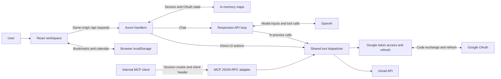
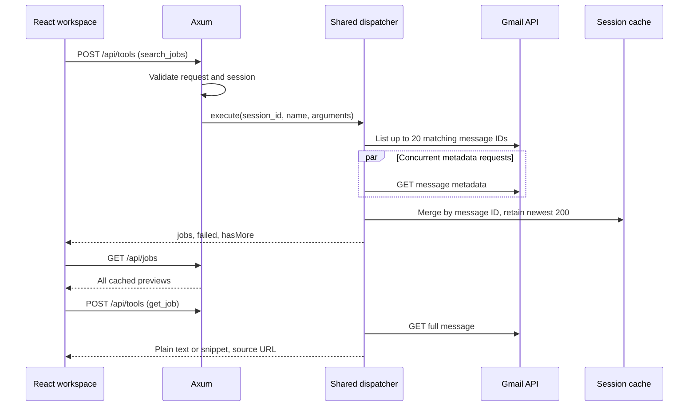

# Architecture

Culmin is a React workspace backed by one Rust/Axum process. The user can act directly through the UI or ask a single AI agent to choose among four Gmail-related tools. Both paths execute the same Rust tool implementations.

This is the implemented architecture. Future production work is identified separately.

## Components

| Component         | Source                                               | Responsibility                                                                       |
| ----------------- | ---------------------------------------------------- | ------------------------------------------------------------------------------------ |
| Workspace         | [`App.tsx`](../frontend/src/App.tsx)                 | Navigation, jobs, saved roles, chat, drafts, calendar, dialogs, and user feedback.   |
| Client boundary   | [`data.ts`](../frontend/src/data.ts)                 | TypeScript types, sample jobs, browser storage helper, and same-origin fetch helper. |
| Source links      | [`MessageText.tsx`](../frontend/src/MessageText.tsx) | Render HTTP(S) links as React elements without injecting message HTML.               |
| HTTP server       | [`main.rs`](../backend/src/main.rs)                  | Routing, shared state, request protection, errors, and MCP adapter.                  |
| Google connection | [`auth.rs`](../backend/src/auth.rs)                  | OAuth lifecycle and token refresh.                                                   |
| Gmail adapter     | [`gmail.rs`](../backend/src/gmail.rs)                | Alert previews, details, and unsent drafts.                                          |
| Agent runtime     | [`agent.rs`](../backend/src/agent.rs)                | Tool definitions, dispatcher, and model loop.                                        |

There is no database, vector index, multi-agent supervisor, background inbox watcher, or scheduled job discovery. The user initiates searches and chat runs. The current frontend keeps most state in one component rather than a separate global state library.

## Operating modes

| Configuration and connection                    | What the user gets                                                                      |
| ----------------------------------------------- | --------------------------------------------------------------------------------------- |
| No credentials, or no Google session            | Sample jobs, local demo chat, browser bookmarks, local demo drafts, and local calendar. |
| Google credentials configured but not connected | The same demo workspace, with Google sign-in available.                                 |
| Google connected, no OpenAI key                 | Live Gmail search, details, and draft creation; AI chat returns a setup message.        |
| Google connected, OpenAI key configured         | Live Gmail tools and model-driven chat.                                                 |
| OpenAI key only                                 | Demo mode; live chat still requires a Google-authenticated session.                     |

The browser asks `/api/status` on startup. The decision to show live data follows `connected`, not the mere presence of environment variables. With no `.env` values and no prior configured session, only placeholder data loads. The browser still requests status from the local backend; it does not call Google or OpenAI in demo mode. Demo draft/calendar persistence uses browser storage, so locally saved demo items survive page reloads.

If the backend cannot be reached, the UI remains usable in demo mode. Configuration flags only test for nonempty server variables; they do not validate credentials with providers.

## Search and detail flow

The API handoff for `get_job` uses the same dispatcher as search. The UI opens the cached preview immediately, then updates the selected dialog with fetched details if it is still the same selection.

A live “job” is an alert email, not a normalized vacancy. One alert may describe multiple jobs. The adapter preserves the original subject and sender; the agent can discuss roles found in the email, but does not persist a separately extracted role table. Search filters in the UI operate on already loaded results. Refresh searches recent Gmail alerts; natural-language chat can issue more targeted Gmail queries.

## Chat flow

The frontend sends only the new user message to `/api/chat`. The server supplies conversation history, instructions, and tool definitions to OpenAI. Model function calls return to the server; the model never receives Google tokens or directly invokes Gmail. The server executes each tool, adds its output to history, and calls the model again until it produces a final message or reaches six model rounds.

The reply includes completion traces. The UI then reloads cached jobs and session-created drafts, keeping the visible workspace aligned with completed actions. This is request/response orchestration: no token stream, live tool-event stream, or WebSocket exists. See [AI engineering and orchestration](ai-orchestration.md).

## Data ownership and lifetime

| Data                                | Owner/storage                                    | Lifetime and behavior                                            |
| ----------------------------------- | ------------------------------------------------ | ---------------------------------------------------------------- |
| Google client secret and OpenAI key | Backend environment                              | Process configuration; never sent to the browser.                |
| Google access/refresh tokens        | Backend session memory                           | Lost on restart, disconnect, or session expiration.              |
| OAuth state                         | Backend pending map plus HttpOnly browser cookie | Ten minutes; consumed by callback.                               |
| Session identifier                  | HttpOnly browser cookie                          | Fixed 24-hour expiry; server checks its creation time.           |
| Discovered alerts                   | Backend session memory                           | Up to 200 previews; not a durable job database.                  |
| Agent conversation                  | Backend session memory                           | Responses input/output items; pruned after some completed turns. |
| Visible chat transcript             | React state                                      | Resets on page reload; no history retrieval endpoint.            |
| Gmail draft content                 | Gmail                                            | Persists independently of the app's session.                     |
| Created-draft list                  | Backend session memory                           | Only drafts made through the current session.                    |
| Bookmarks                           | `culmin:<email>:saved` in localStorage           | Browser-local IDs, partitioned by account.                       |
| Calendar events                     | `culmin:<email>:events` in localStorage          | Browser-local planning; no Google Calendar integration.          |
| Demo bookmarks/events/drafts        | `culmin:demo:*` in localStorage                  | Separate from live account data.                                 |

Account-based localStorage keys are a UI partition, not encryption or a security boundary against someone with access to the browser profile. A bookmark can outlive its session's alert cache and become visible again when that message is rediscovered.

## MCP boundary

`POST /api/mcp` provides a small internal JSON-RPC adapter with JSON HTTP responses. `initialize` returns protocol version `2025-11-25`, tool capabilities, and server identity. Other implemented methods are `ping`, `tools/list`, and `tools/call`; notifications with no ID receive HTTP 202. Tool errors are represented with `isError: true` and text content. Invalid JSON-RPC versions and unknown methods produce protocol errors.

This is not the network path used by the built-in agent. The agent adapts the same tool registry to OpenAI function schemas and dispatches calls in process. That avoids a loopback HTTP request per action while preserving a single implementation for each tool.

The MCP endpoint requires the application's session cookie and `X-Culmin-Client: web`. It has no independent MCP OAuth discovery, bearer-token flow, full protocol negotiation, GET/SSE stream, or resume mechanism. The constant initialize response is not a claim of full MCP protocol conformance. Independent remote clients would need a production transport/authentication layer and conformance tests.

## Trust boundaries

The server verifies browser-bound OAuth state, checks supplied Origins, and requires a custom header for POSTs. Cookies are HttpOnly and SameSite; HTTPS origins also enable Secure. Private handlers authenticate a session before invoking tools.

The model receives relevant Gmail data through tool results. The prompt tells it to treat that data as untrusted and to draft only at the user's request. Those instructions are behavioral controls, not a separate authorization engine. The code has no mail-sending tool or endpoint, but does expose draft creation. There is no deterministic user-approval gate or idempotency store around model-triggered drafts. The [orchestration document](ai-orchestration.md#safety-and-authority) distinguishes these guarantees explicitly.

Email HTML is never injected into the UI. Source message URLs currently target Gmail's `/u/0` web account slot; a browser with multiple Google accounts may need to switch to the connected account.

## Deployment and current limits

In development, Vite serves the UI and proxies `/api` to Axum. Requests remain same-origin from the browser's perspective. In a local production build, Axum serves the Vite assets and API together; unknown static routes fall back to `index.html`.

One process owns all active sessions. Multiple instances would need shared session storage and coordinated run admission. Restart/redeployment requires users to reconnect Google. The static asset path is tied to the compile-time checkout location and needs attention when packaging a standalone binary.

Production work remains: encrypted durable credentials, bounded/rate-limited session admission, shared storage, draft idempotency, explicit authorization for tool writes, provider integration tests, observability, and Google consent-screen requirements. These are future changes, not features supplied by formatting or documentation.

## Design choices

| Choice                            | Benefit                                         | Current tradeoff                                   |
| --------------------------------- | ----------------------------------------------- | -------------------------------------------------- |
| Single Rust service               | Simple deployment and shared tool logic.        | Sessions vanish on restart.                        |
| Metadata-first Gmail search       | Smaller responses and concurrent loading.       | An extra read is needed for full details.          |
| One sequential tool-calling agent | Easy to follow and bound.                       | No parallel model-directed tasks.                  |
| In-process tool dispatch          | No extra network hop inside chat.               | External MCP access needs more protocol/auth work. |
| Browser-local planner             | Works immediately without another Google scope. | No cross-device sync.                              |
| Explicit demo mode                | Usable before secrets are configured.           | Demo chat is scripted, not model-driven.           |
